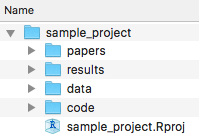

> ## Learning objectives {.objectives}
>
> * Understand motivation for code and data management
> * Know how to organize code, data, and results
> * Be able to create and use an RStudio project
>

## Code & Data Organization

The scientific process is naturally incremental, and many projects
start life as random notes, some code, then a manuscript, and
eventually everything is a bit mixed together.

<blockquote class="twitter-tweet">
Managing your projects in a reproducible fashion doesn't just make your science reproducible, it makes your life easier.
&mdash; Vince Buffalo (@vsbuffalo) <a href="https://twitter.com/vsbuffalo/status/323638476153167872">April 15, 2013</a></blockquote>

A good project layout will ultimately make your life easier:

* It makes it easier to understand the pipeline from source data to final product
* It helps ensure the integrity of your data
* It makes it simpler to share your code with someone else
* It allows you to easily upload your code with your manuscript submission
* It makes it easier to pick the project back up after a break

### Best practices for project organization

Although there is no "best" way to lay out a project, there are some general
principles to adhere to that will make project management easier:

#### Treat raw data as read only

This is probably the most important goal of setting up a project. Raw data should never be edited, because you can never be sure that you will want to keep any edit you make, and you want to have a record of any changes you make to data. Therefore, treat your raw data as "read only", perhaps even making a `raw_data` directory that is never modified. If you do some data cleaning or modification, save the modified file separate from the raw data, and ideally keep all the modifying actions in a script so that you can review and revise them as needed in the future.

#### Treat generated output as disposable

Anything generated by your scripts should be treated as disposable: it should
all be able to be regenerated from your scripts. There are lots of different ways
to manage this output, and what's best may depend on the particular kind of project.
At a minimum, it's useful to have separate directories for each of the following:

- data: Ideally .csv files as these are flat, transparent, and universal. You may have other specialized formats as well. .rda and .rds are R-specific data files but you never *need* to use these.
- code: .R files, perhaps .do files if Stata is your thing, .py files for Python, etc.
- results: .png or .pdf files for plots; .tex or .txt files for tables
- papers: .tex if you write in LaTeX, .doc for Word, .Rmd for RMarkdown (which we recommend and will cover tomorrow afternoon), and .pdf or .html rendered documents.

### RStudio Projects

RStudio has a feature to help keep everything organized in a self-contained, reproducible package, called a "project".

A project is a small file with a `.Rproj` extension, but you can think of all the files and sub-directories as belonging to that project. We recommend creating a directory and a project file for each project you work on. It should look something like this:

When you want to work on this project using R, double click on the .Rproj file, and RStudio will open it and keep everything organized for you. You can also open an existing project from RStudio by clicking "File -> Open project..."

> #### Challenge -- Create a Project {.challenge}
>
> Let's create a new project in RStudio that will contain all of our work for this workshop.
>
> 1. Click the "File" menu button, then "New Project".
> 2. Click "New Directory".
> 3. Click "Empty Project".
> 4. Type a descriptive directory name: This is the title of your project, so for this one you might use "DataCarpentry" or something similar.
> 5. Store the new directory in a sensable place in your computer's organizational scheme. 
> If you have a "workshops" or "classes" directory that would make sense. 
> This will create a new directory called "DataCarpentry" in that directory.
> 6. Click "Create Project".
>

If everything went right, RStudio should've flickered and you should be looking at a pretty bare RStudio instance. 
That's okay. Click on the "Files" tab in the lower right pane. Your .Rproj file should be there with nothing else. 
You've got the bare bones of a new project. Let's now create the directory structure described above, a folder for
each of data, code, results, and papers. You can do this in RStudio by clicking on the "New Folder" button in the 
Files pane, or in your OS by navigating to the directory you just created. Then we'll download the data that we're
going to use in this workshop and put that in a "raw_data" directory inside your "data" directory.

> #### Challenge -- Project Organization {.challenge}
>
> - In your project directory, either using the Project tab of RStudio or your OS' file system, 
> create the following directories:
>     - data
>     - code
>     - results
>     - papers
> - Clicking on [this link](https://minhaskamal.github.io/DownGit/#/home?url=https://github.com/data-lessons/gapminder-R/tree/gh-pages/data/raw_data) will take you to a page that downloads a .zip file that contains all the data needed for this workshop. Download it, unzip it, and move the new "raw_data" folder into the data folder of your project.
>
